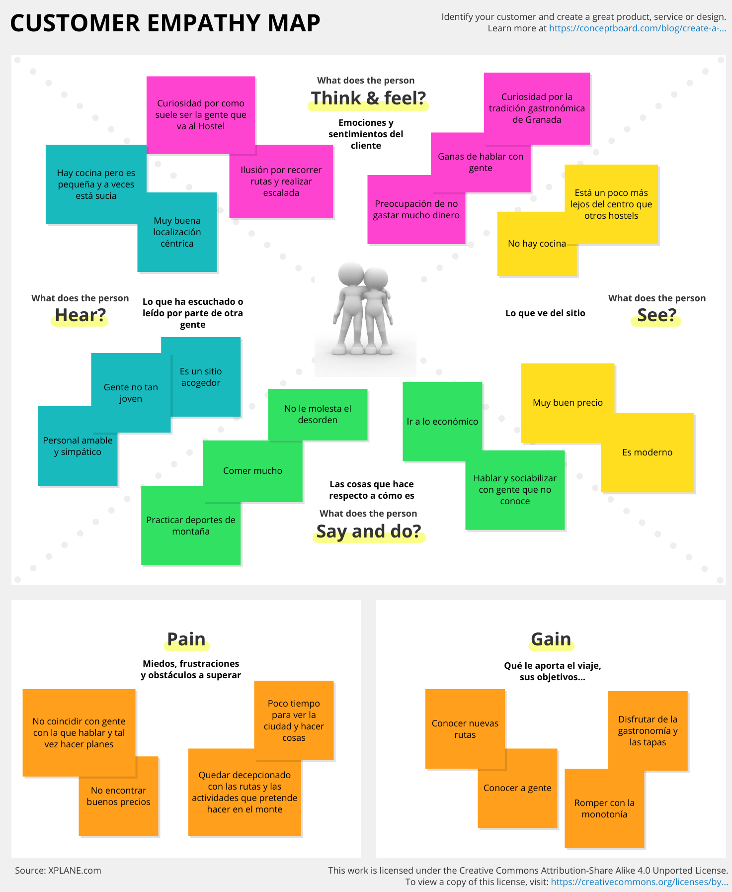
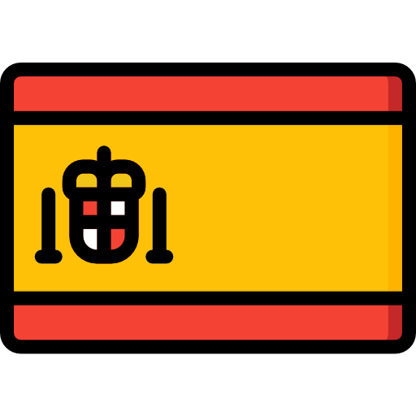
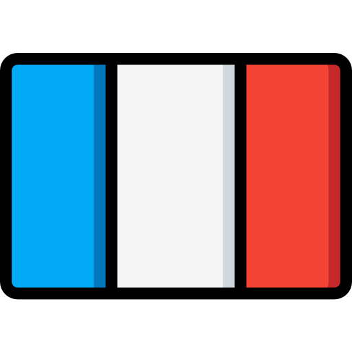
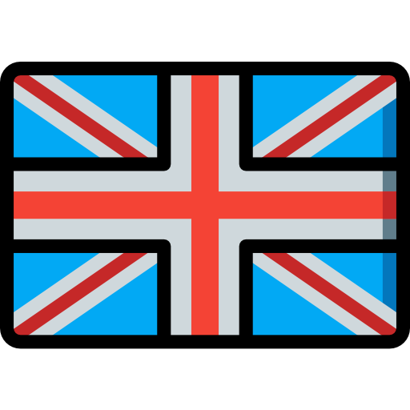
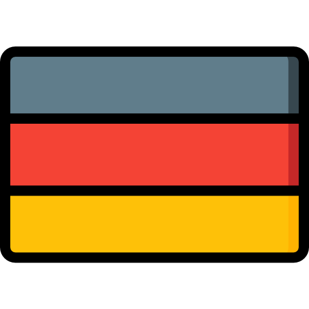

## DIU - Practica2, entregables
### Ideación 
A partir de la información adquirida mediante el análisis de la usabilidad de la aplicación se va a realizar un nuevo planteamiento de esta teniendo en cuenta las dos personas creadas anteriormente.

Para realizar esta nueva propuesta de diseño es necesario analizar el comportamiento y la reacción de los posibles usuarios ante el funcionamiento y la visualización de la aplicación obteniendo retroalimentación.

Este estudio se va a realizar mediante los mapas de empatía de cada persona en los cuales se pone en comparación lo que las personas oyen, ven, sienten y hacen ayudando a detectar sus dolores y las ganancias. 

A continuación se adjuntan los mapas de empatía mediante imágenes.
#### Mapa de empatía

### PROPUESTA DE VALOR
Una vez hemos replanteado la propuesta de valor en el apartado anterior procedemos a diseñar una nueva propuesta descrita a continuación. Por otro lado complementamos la definición de esta mediante un LeanUX canvas que ayuda a tener una mejor visión y clarificar conceptos.

#### Descripción de la propuesta de valor
Se quiere diseñar un microsite que permita que los mismos clientes o residentes del hostel puedan seleccionar de entre una lista de eventos, preestablecidos por el personal del sitio, cuales son en los que les apetecería más participar durante su estancia en el hostel.

A la hora de valorar estas actividades tendrán la capacidad de dar retroalimentación o sugerir cambios para que se adapten más a sus necesidades e intenciones.

La aplicación permitirá a los usuarios ver los eventos que se han programado y apuntarse mediante un formulario para confirmar su asistencia.

Al haber acabado el evento en el que han participado los usuarios podrán dejar comentarios y valoraciones.

#### ScopeCanvas

### TASK ANALYSIS
Tras analizar el repertorio de tareas de nuestra propuesta para el microsite hemos llegado a la conclusión de que una matriz de tareas ,para representar la frecuencia de realización de estas por parte de los distintos usuarios que harán uso de la aplicación, puede resultar más útil debido a que estas no tienen demasiadas líneas de acciones pudiéndose representar fácilmente.

Para el desarrollo de este análisis se ha llevado a cabo la elección de tres grupos mayoritarios de usuarios que serán los que interactuarán con la aplicación de manera distinta:

- **Administrador**: Se encargará de administrar el site, pudiendo ejercer con permisos de gestión.
- **Cliente**: Se distinguen dos subgrupos:
    - **Individual**: Cliente que viaja solo.
    - **Grupo**: Conjunto de clientes que viajan en un mismo grupo y por lo tanto comparten intereses y objetivos.

#### User Task Matrix 
| Tareas / Grupos de Usuarios | Administrador | Cliente Individual | Cliente Grupo |
|-----------------------------|---------------|--------------------|---------------|
| Iniciar sesión | H | H | H |
| Cerrar sesión | H | H | H |
| Filtrar evento por nombre | L | L | L |
| Filtrar evento por tipo de actividad | L | M | H |
| Filtrar por evento propuesto o programado | L | H | H |
| Filtrar evento por fecha | M | M | H |
| Filtrar evento por valoración | H | L | L |
| Filtrar evento por votación | H | - | - |
| Filtrar evento por precio | L | H | M |
| **Publicar propuesta de evento** | H | - | - |
| **Votar propuesta de evento** | - | H | M |
| **Inscribirse a evento** | - | H | H |
| Publicar sugerencias | - | L | L |
| Valorar evento | - | M | L |
| Consultar opiniones de otros clientes  | H | L | L |
| Publicar opinión | - | M | L |
| Cambiar idioma | L | M | M |
| Eliminar opiniones (Con lenguaje ofensivo o inapropiadas)  | L | - | - |
| Consultar aceptación de cada evento | H | - | - |
| Programar evento a realizar | H | - | - |
| Consultar sugerencias | H | M | M |
| Votar sugerencias de otros clientes | L | M | M |

### ARQUITECTURA DE INFORMACIÓN

#### Sitemap 

Hemos realizado el sitemap para reproducir la organización lógica de la navegación. Para ello hemos representado las distintas instancias del microsite y sus relaciones, de forma  que podemos ver que secuencia de acciones tenemos que realizar para llegar a cada sub apartado de nuestra página.

#### Labelling 
Como se observa se ha resaltado de color anaranjado los apartados que solo estan disponibles si inicias sesión como administrador, también se ha añadido los nombres de las instancias que representan un .html independiente.

| ETIQEUTA | ICONO | DESCRIPCIÓN|
|----------|-------|------------|
| Home |  | Vista principal del microsite, desde la cual podemos ver las secciones principales, iniciar sesión, y ver los distintos eventos |
| Usuario |  |  Vista donde se le ofrecerá la posibilidad al usuario de iniciar sesión o registrarse |
| Cerrar sesión |  | Vista donde el usuario confirma que quiere cerrar sesión |
| Inicio sesión / registrarse |  | Botón que permite enviar el formulario que hemos rellenado con nuestras credenciales / datos |
| Eventos |  | Vista donde se visualizará todo el catálogo de eventos configurados por los administradores |
| Ayuda |  | Vista donde el usuario podrá consultar ayuda sobre el funcionamiento de la aplicación así como información relevante sobre la empresa |
| Filtrar evento por… |  | Vista dentro de la página de Eventos, que permite al usuario filtrar los eventos en base a distintos criterios |
| Crear evento |  | Vista donde el administrador, a través de un formulario, puede configurar la información de un nuevo evento y subirlo |
| Votar propuesta de evento |  | Input usado por el usuario a la hora de votar por una propuesta de evento |
| Inscribirse a evento |  | Botón que le va a permitir al usuario apuntarse a un determinado evento |
| Publicar sugerencias |  | Input que permite, tras redactar un formulario, enviarlo. |
| Publicar opinión |  | Input que permite a un usuario redactar y publicar una opinión sobre un evento en el cual haya participado |
| Cambiar idioma |     | Botón que permite elegir entre 3 idiomas para traducir la página |
| Votar sugerencias de otros clientes |  | Botón para votar las sugerencias que han subido otros usuarios sobre propuestas de eventos |
| Mis sugerencias |  | Vista que ilustra todas las sugerencias publicadas por el usuario que lo consulta |
| Mis actividades |  | Vista de las actividades que el usuario tiene activas |
| Editar evento |  | Botón para editar evento |
| Configuración |  | Botón que te lleva a la configuración de tu perfil |
| Enviar |  | Botón para colgar opiniones y sugerencias |

### Prototipo Lo-FI Wireframe 
| Home | User | Inicio Sesión| Registrarse |
|------|------|--------------|-------------|
|  |  |  |  |
|------|------|--------------|-------------|
| Mi perfil | Eventos | Eventos (Admin) | Evento |
|------|------|--------------|-------------|
|  |  |  |  |

| Evento (Admin) | Ayuda | 
|------|------|
|  |  |

#### Correlación de las páginas respecto al sitemap

### Conclusiones 
Gracias a esta práctica, hemos podido profundizar un poco más en lo que conlleva la realización de una nueva funcionalidad a un servicio ya definido. 
Hemos comprendido todo lo que esto implica, ya que lo principal es satisfacer las necesidades de los clientes para así poder atraerlos más a nuestro servicio principal (El hostel).

Como hemos visto se trata de un procedimiento cargado de detalles y con muchas etapas, pero todo muy necesario para concretar bien todas las características del nuevo servicio que queremos diseñar.

Además consideramos que gracias a los bocetos hemos podido mejorar otros apartados anteriores, ya que cuando de verdad nos ponemos a diseñar la funcionalidad, realmente nos damos cuenta de lo que realmente necesitamos.

En conclusión nos ha parecido una práctica muy concreta y útil para poder conocer el proceso que conlleva la incorporación de un nuevo servicio a un producto principal.
