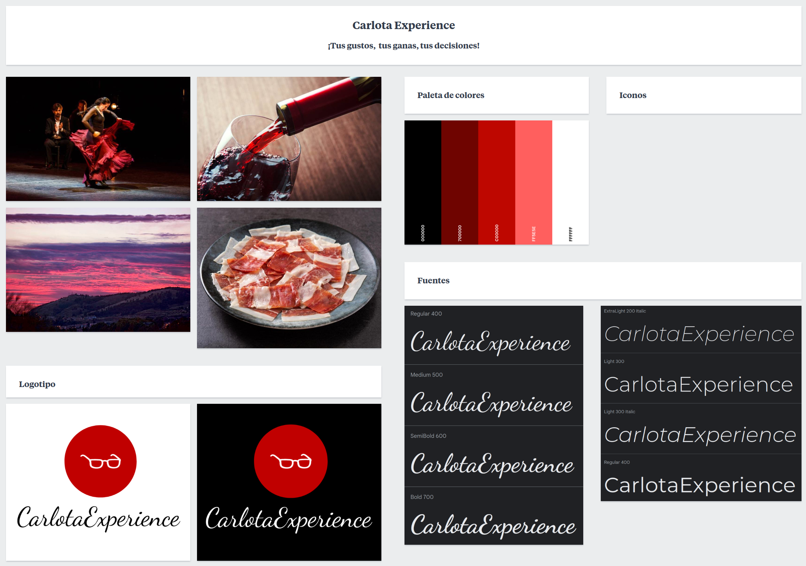

# DIU - Practica 3

En esta parte de la práctica se pretende realizar el diseño del microsite propuesto en la segundo parte realizada anteriormente. Para ello se procederá a través de varias etapas las cuales ayudarán a plantear mejor la idea y poder sacar un diseño de calidad. Estas son:

- Moodboard: Consiste en el confeccionamiento de un "tablero" que ayude a identificar la experiencia visual que debe tener la aplicación así como también aporta un logotipo.

- Landing page: Se basa en crear el diseño, a partir del moodboard, de una landing page para el microsite, es decir, se creará la vista con un solo boceto de una página promocional.

- Mockup: 

## Moodboard (diseño visual + logotipo)   

### Imágenes de inspiración

Para empezar se necesita cierta inspiración que nos permita empezar a desarrollar el aspecto visual de la página. Por ello se adjuntan varias imágenes que nos permiten hacernos a la idea de que experiencias y sensaciones nos debe transmitir el diseño de la aplicación. Como podemos ver se trata de imágenes con un tono cálido, que invitan a disfrutar de la gastronomía y de la cultura emanando un cierto sentimiento de pasión hacia el <u>Carpe Diem</u>.

### Paleta de colores

La paleta de colores extraida a partir de las imágenes viene a representar todas aquellas sensaciones comentadas. Gracias a esta el diseño cobrará vida y reflejará la experiencia visual deseada.

### Fuentes

A la hora de usar texto también es necesario contar con fuentes que reflejen ese carácter partícular que tiene la página de Carlota Braun. Se han obtenido dos estilos distintos, el de la izquierda se usará para textos cortos como títulos o contenido importante y el de la derecha será empleado para escribir el texto normal. Aús así cabe destacar que esta última también puede ser empleada para títulos.

### Logotipo

Con todos los conceptos anteriores recopilados se ha realizado un logotipo para la aplicación. Se adjuntan dos variaciones de éste para que pueda ser usado tanto en fondos negros como en fondos blancos. Como se puede observar se ha cogido una clara inspiración en la marca de Carlota Braun ya que, aparte de que los colores usados son fieles a la experiencia de esta, se han usado unas gafas de sol como icono central haciendo referencia al logo de Carlota.

### Iconos

Toda buena aplicación necesita transmitir de manera rápida y eficaz la información al usuario sin que este tenga que realizar un gran esfuerzo de comprensión, por ende se usa un conjunto de iconos que facilitan la interacción con el sitio.

## Landing Page

## Guidelines

## Mockup: LAYOUT HI-FI

## Documentación: Publicación del Case Study

(incluye) Valoración del equipo sobre la realización de esta práctica o los problemas surgidos
 
