# DIU - Practica 3

El proyecto consiste en el desarrollo de una aplicación móbil para que el usuario, cliente de CarlotaBraun, pueda decidir qué eventos quiere realizar durante su estancia. El administrador irá publicando propuestas de actividades y los usuarios podrán votar cuales prefieren, entonces se elegirá la más popular y se programará para una fecha en concreto. Como añadidos los usuarios podrán colgar sugerencias acerca de cambios o mejoras en las propuestas publicadas así como votar las sugerencias de otros Una vez haya acabado una actividad los usuarios que hayan participado podrán subir su experiencia u opinión así como una valoración numérica.

## Moodboard (diseño visual + logotipo)   

### Imágenes de inspiración

Para empezar se necesita cierta inspiración que nos permita empezar a desarrollar el aspecto visual de la página. Por ello se adjuntan varias imágenes que nos permiten hacernos a la idea de que experiencias y sensaciones nos debe transmitir el diseño de la aplicación. Como podemos ver se trata de imágenes con un tono cálido, que invitan a disfrutar de la gastronomía y de la cultura emanando un cierto sentimiento de pasión hacia el <u>Carpe Diem</u>.

### Paleta de colores

La paleta de colores extraida a partir de las imágenes viene a representar todas aquellas sensaciones comentadas. Gracias a esta el diseño cobrará vida y reflejará la experiencia visual deseada.

### Fuentes

A la hora de usar texto también es necesario contar con fuentes que reflejen ese carácter partícular que tiene la página de Carlota Braun. Se han obtenido dos estilos distintos de la página de [google fonts](https://fonts.google.com/), el de la izquierda **"Dancing Script"** se usará para textos cortos como títulos o contenido importante y el de la derecha **"Montserrat"** será empleado para escribir el texto normal. Aús así cabe destacar que esta última también puede ser empleada para títulos. 

### Logotipo

Con todos los conceptos anteriores recopilados se ha realizado un logotipo para la aplicación. Se adjuntan dos variaciones de éste para que pueda ser usado tanto en fondos negros como en fondos blancos. Como se puede observar se ha cogido una clara inspiración en la marca de Carlota Braun ya que, aparte de que los colores usados son fieles a la experiencia de esta, se han usado unas gafas de sol como icono central haciendo referencia al logo de Carlota.

### Iconos

Toda buena aplicación necesita transmitir de manera rápida y eficaz la información al usuario sin que este tenga que realizar un gran esfuerzo de comprensión, por ende se usa un conjunto de iconos que facilitan la interacción con el sitio. Estos iconos se han sacado de la aplicación de Flaticons [Flat icons](https://www.flaticon.com/).

## Landing Page

## Guidelines

Antes de proceder con el diseño es necesario que tengamos claro cuales son los patrones relevantes que vamos a necesitar. Para ello hemos seleccionado un cojunto de estos que nos permitirá desarrollar de manera completa la aplicación, permitiendo la implementación de todas las funcionalidades.

### Patrones de diseño

A continuación se describen, en base a nuestra aplicación, los más relevantes. Estos han sido extraídos de la página [patrones diseño](https://ui-patterns.com/patterns/) ya que continene un cojunto muy variado de patrones además de su completa descripción y ejemplos.

#### Obtener información

- **Configuración**: Permite configurar los parámetros de la aplicación. 
- **Buenos valores predeterminados**: Un valor por defecto con probabilidades de encajar en la información deseada por usuario.
- **Retroalimentación de los inputs**: Al introducir la información se aporta retroalimentación.
- **Selección en calendario**: Se usuará para seleccionar la fecha de un evento.
- **Input ampliable**: Input que aparece cuando se quiere escribir una sugerencia u opinions.
- **Indicación de input**: Indica la información a introducir.
- **Cuadro de ayuda**: Caja que aparece encima de los formularios que pretende aportar retroalimentación.
- **Valorar contenido**: Valorar propuesta de evento o evento.
- **Votar para promover**: Permite a los usuarios votar otras sugerencias.
- **Reportar**: Permite a un usuario reportar sugerencias u opiniones que puedan herir a demás usuarios.

#### Navegación

- **Pestañas de módulo**: Permiten intercambiar entre el contenedor de sugerencias y el de opiniones.
- **Link al home**: Permite volver a la página principal desde el título o logo.
- **Modal**: Permite acceder a formularios y demás contenido sin salir de la vista actual.
- **Menú vertical desplegable**: Permite cambiar el idioma y seleccionar el valor de algunos filtros.
- **Tarjetas**: Posibilita la visualización de los eventos de manera elegante.
- **Scroll contínuo**: Consiste en que a medida que se vaya bajando por la página se recarguen nuevas tarjetas.
- **Calendario de eventos**: Visualiza los eventos ordenados por la fecha.
- **Etiquetado**: Permite buscar a través de palabras clave.
- **Favoritos**: El usuario puede seleccionar sus eventos o propuestas como favoritos para encontrarlos fácilmente después.

#### Tratamiento de datos

- **FAQ**: Preguntas y respuestas habituales de la sección de ayuda.
- **Diapositivas**: Permite visualizar distintas imágenes en la vista principal.
- **Autocompletado**: Autocompleta el campo de búsqueda de eventos.
- **Filtros de búsqueda**: Permiten realizar búsquedas más facilmente a través de restricciones.

#### Social

- **Leaderboard**: Permite obtener los eventos más populares.

#### Identificación y guia

- **Sin necesidad de registro**: Consiste en que un usuario es capaz de realizar acciones en la aplicación sin la necesidad de tener que crearse una cuenta.
- **Registro de cuenta**: Permite crear una nueva cuenta de usuario.

### Guías de estilo

El estilo de nuestra aplicación se basa principalmente en un lenguaje visual extraido de las sensaciones del moodboard del primer apartado y una estructuración diseñada a partir de los patrones de diseño expuestos combinados con los iconos descritos también en el moodboard.

#### Lenguaje visual

El lenguaje visual contempla la siguiente paleta de colores:

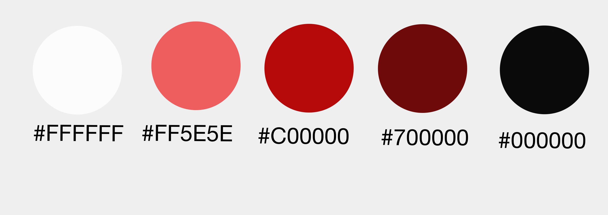

Los colores que contemplamos se han escogido a consciencia ya que se quiere transmitir esa sensación de calidez y cercanía plasmada en las imágenes del moodboard.

Para empezar el negro da un toque formal que combina muy bien con el rojo más oscuro, un rojo que transmite una sensación que podría recordar al sabor del vino o al ritmo de un tablado flamenco. Por otro lado también queremos que la aplicación se sienta viva como un atardecer en Granada, por ende, se han descrito dos rojos con tonalidades más claras. En última instancia se quiere dar una visión de limpieza y nitidez usando el color blanco absoluto, un color que permite al usuario dar un respiro y sentirse cómodo navegando a través de las páginas.

### Estructura del diseño

La estructura se basa en un menú básico en la parte inferior que comparten todas las vistas y a partir de la cual se puede navegar entre ellas. La parte superior de cada vista también contendrá una barra con el título de la marca, que permitirá volver al home, y una opción que permita cambiar de idiomar mediante un menú vertical desplegable. 

Todo el contenido debe estar bien diferenciado de manera que el usuario pueda distinguir las distintas secciones y no se sienta abrumado por la falta de espacio o la asimetría.

Los botones, en su gran mayoría serán de color rojo (#C00000) aunque puede haber variaciones con las tonalidades (#700000) o (#FF5E5E). Por otro lado las proporciones en los formularios mantendrán todas las mismas proporciones y los campos de estos responderán a la misma apariencia.

## Mockup: LAYOUT HI-FI

| Home | User | Inicio Sesión| Registrarse |
|------|------|--------------|-------------|
| 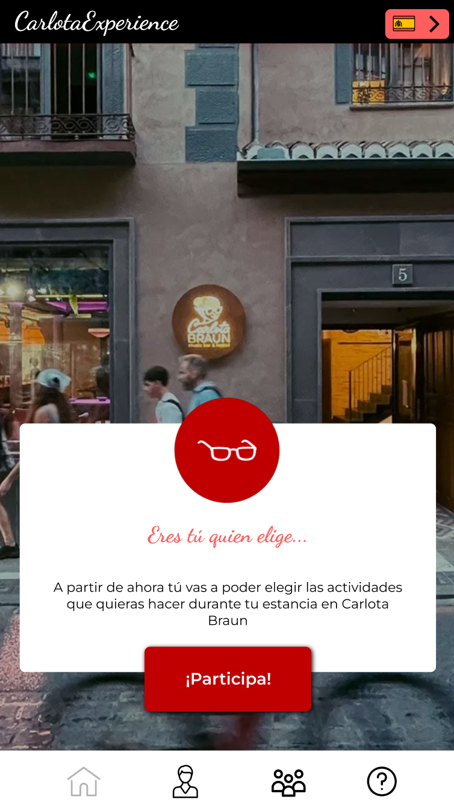 | 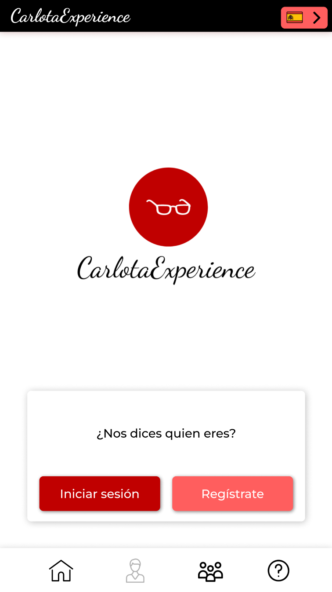 | 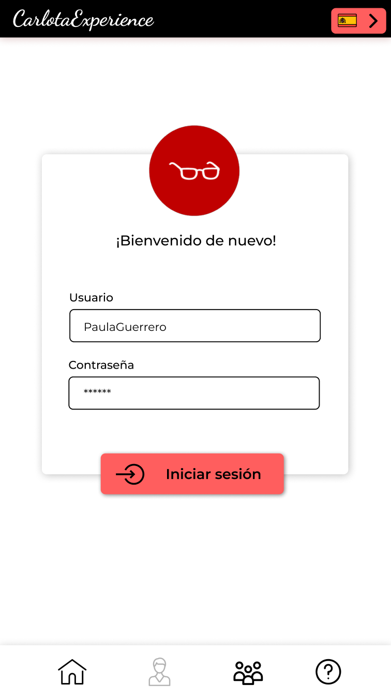 | 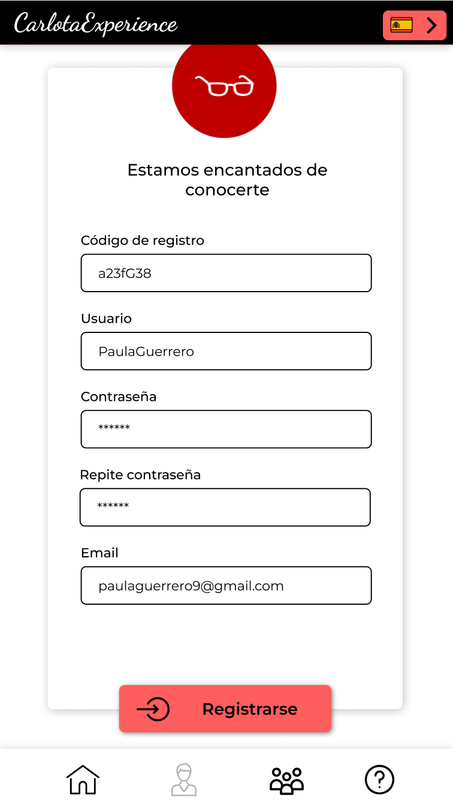 |
| Mi perfil | Eventos programados | Evento programado | Eventos propuestos |
|------|------|--------------|-------------|
| 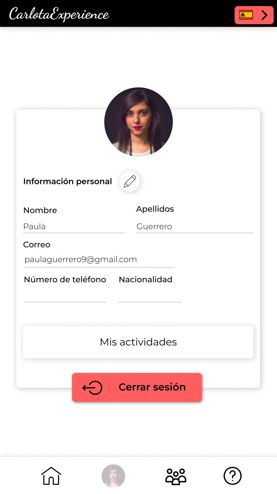 | 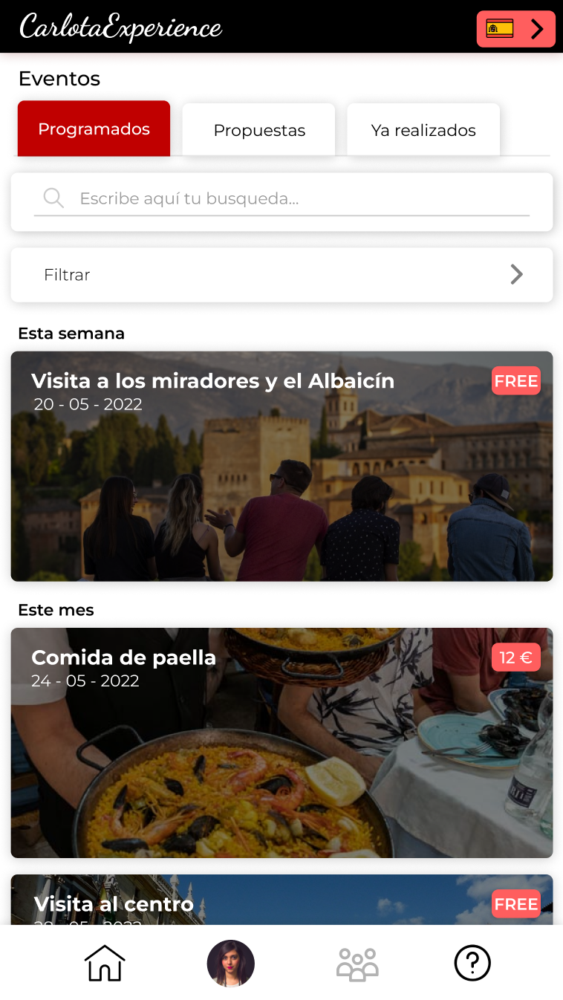 | 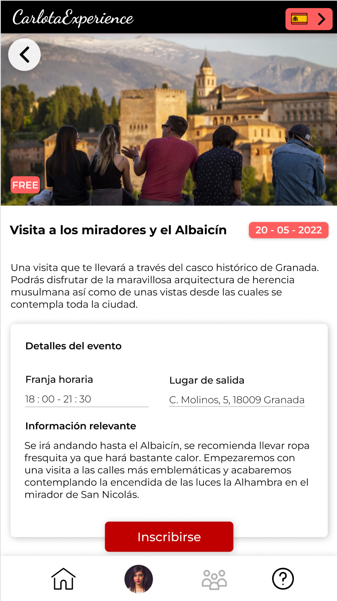 | 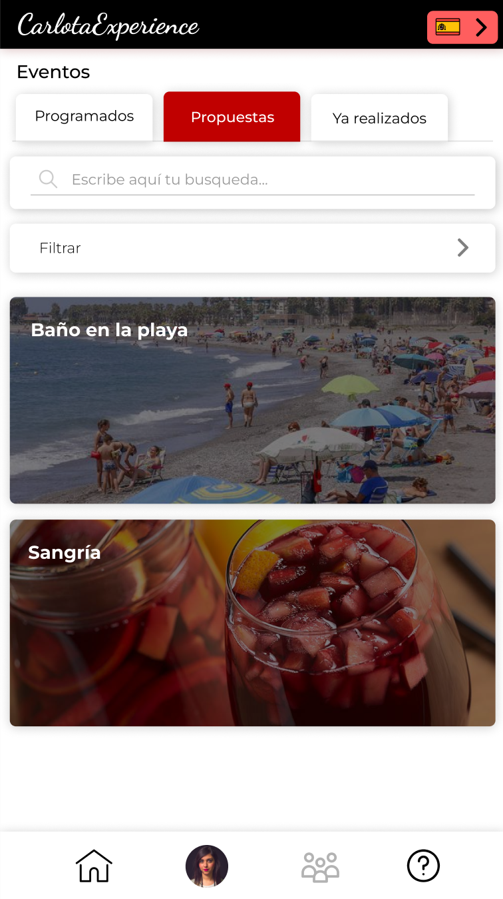 |

| Evento propuesto | Eventos realizados | Evento realizado |
|------|------|------|
| 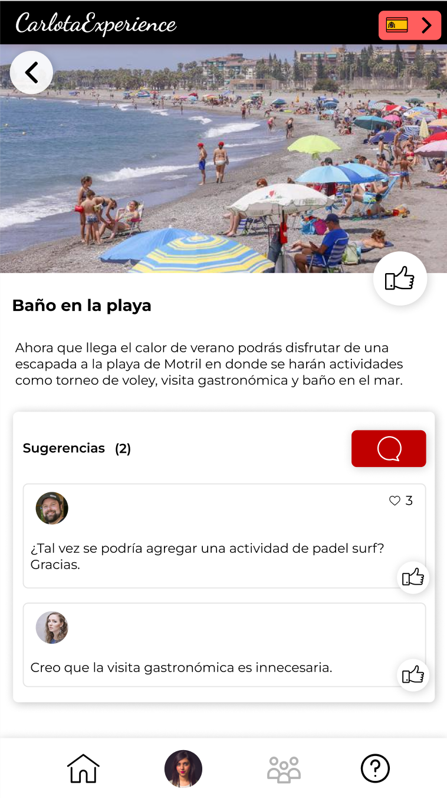 | 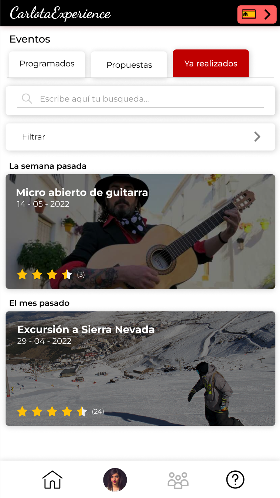 | 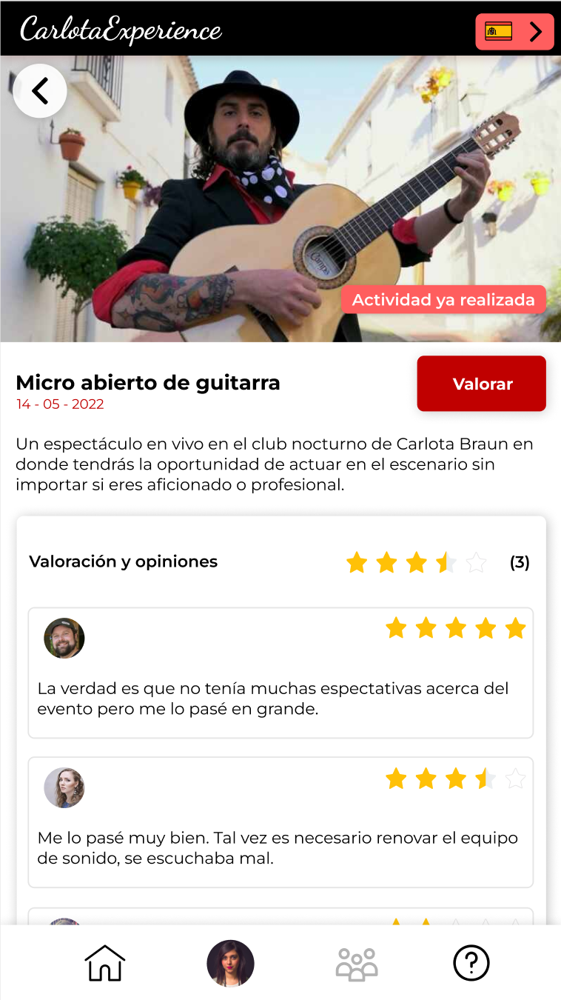 |

Todos estos diseños se han integrado mediante una simulación gravada incluida en la carpeta con dicho nombre en este mismo repositorio.

## Documentación: Publicación del Case Study

Tras realizar esta práctica hemos podido atravesar, de primera mano, el proceso que conlleva el diseño completo de una interfaz con todo el trabajo que esto conlleva, desde la elección de una adecuada paleta de colores al diseño de un buen logotipo o una fuente correcta. Además hemos aprendido acerca de patrones de diseño que luego han sido implementados correctamente a la hora de diseñar los Prototipos HIFI.

En conclusión, gracias a la realización de esta práctica nos hemos podido poner en la piel de un diseñador de interfaces y hemos comprendido que esto no resulta una tarea sencilla, conlleva un gran esfuerzo y ser muy cuidadoso con todos los detalles para que el resultado final sea correcto.
 
