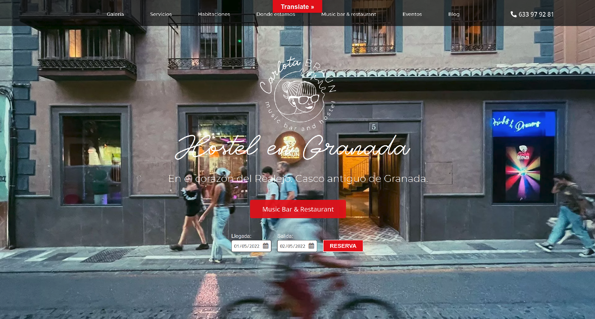
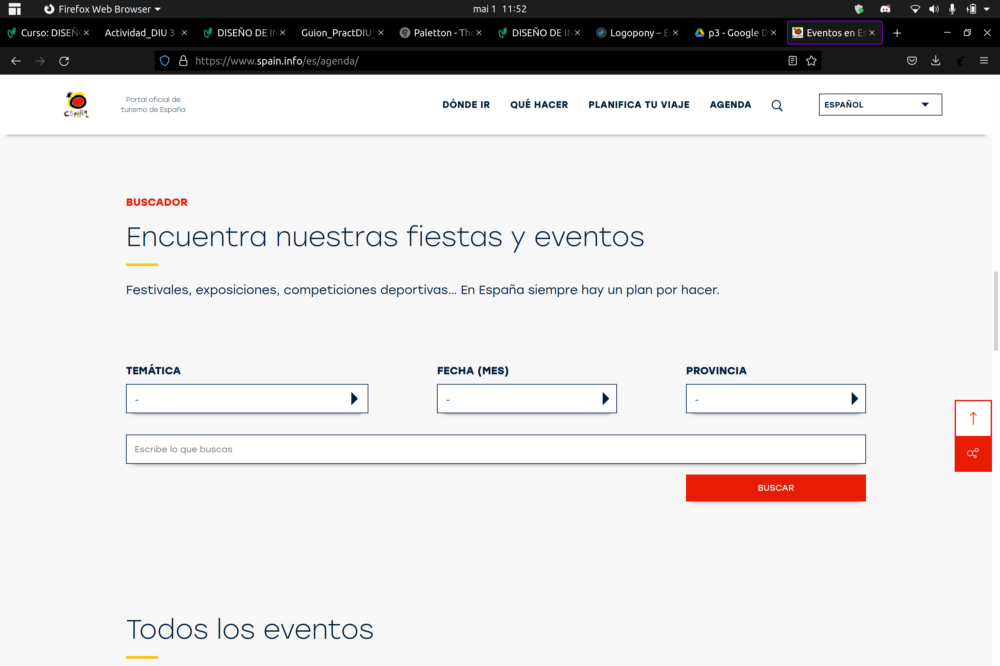

# DIU - Practica 3

En esta parte de la práctica se pretende realizar el diseño del microsite propuesto en la segundo parte realizada anteriormente. Para ello se procederá a través de varias etapas las cuales ayudarán a plantear mejor la idea y poder sacar un diseño de calidad. Estas son:

- Moodboard: Consiste en el confeccionamiento de un "tablero" que ayude a identificar la experiencia visual que debe tener la aplicación así como también aporta un logotipo.

- Landing page: Se basa en crear el diseño, a partir del moodboard, de una landing page para el microsite, es decir, se creará la vista con un solo boceto de una página promocional.

- Mockup: 

## Moodboard (diseño visual + logotipo)   

Para empezar se necesita cierta inspiración que nos permita empezar a desarrollar el aspecto visual de la página. Por ello a continuación de adjuntan varias imágenes que nos permiten hacernos a la idea de que experiencias y sensaciones nos trasmitirá el diseño de la aplicación.

    
    
    
    

## Landing Page

## Guidelines

## Mockup: LAYOUT HI-FI

## Documentación: Publicación del Case Study

(incluye) Valoración del equipo sobre la realización de esta práctica o los problemas surgidos
 
