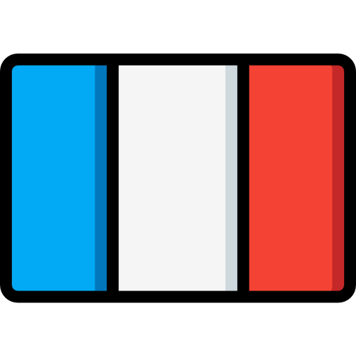
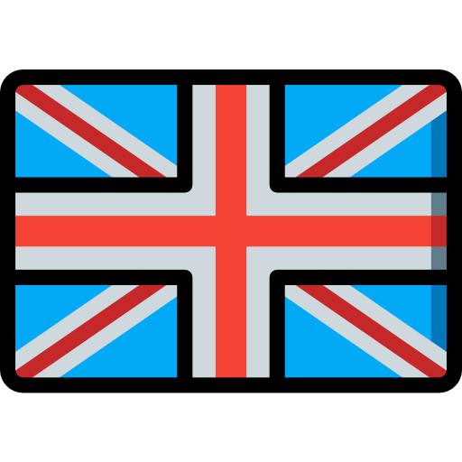
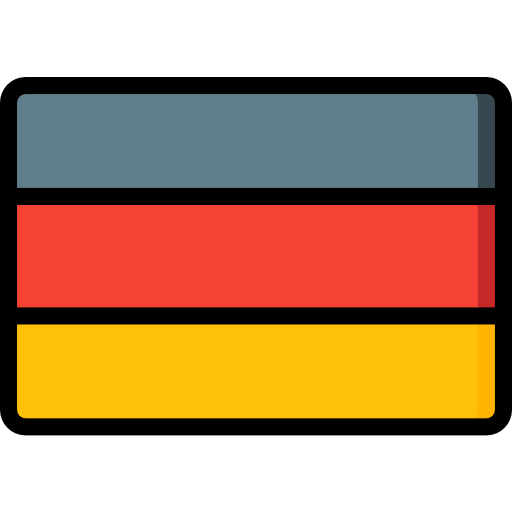
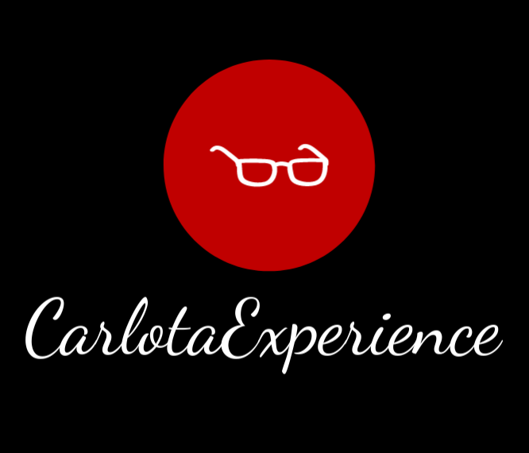

# DIU - Practica 3

En esta parte de la práctica se pretende realizar el diseño del microsite propuesto en la segundo parte realizada anteriormente. Para ello se procederá a través de varias etapas las cuales ayudarán a plantear mejor la idea y poder sacar un diseño de calidad. Estas son:

- Moodboard: Consiste en el confeccionamiento de un "tablero" que ayude a identificar la experiencia visual que debe tener la aplicación así como también aporta un logotipo.

- Landing page: Se basa en crear el diseño, a partir del moodboard, de una landing page para el microsite, es decir, se creará la vista con un solo boceto de una página promocional.

- Mockup: 

## Moodboard (diseño visual + logotipo)   

Para empezar se necesita cierta inspiración que nos permita empezar a desarrollar el aspecto visual de la página. Por ello a continuación de adjuntan varias imágenes que nos permiten hacernos a la idea de que experiencias y sensaciones nos trasmitirá el diseño de la aplicación.

    
    
    
    

Partiendo de las imágenes anteriores como inspiración obtenemos una paleta de colores que combine bien con esa experiencia visual.

A la hora de usar texto también es necesario contar con fuentes que reflejen ese carácter partícular que tiene la página de Carlta Braun. Se han obtenido dos estilos distintos, el de la izquierda se usará para textos cortos como títulos o contenido importante y la de la derecha será empleada para escribir el texto normal. Aús así cabe destacar que esta última también puede ser empleada para títulos.

| Fuente característica | Fuente de escritura | 
| --------------------- | ------------------- | 
|  |  | 

Toda buena aplicación necesita transmitir de manera rápida y eficaz la información al usuario sin que este tenga que realizar un gran esfuerzo de comprensión, por ende se usa un conjunto de iconos que facilitan la interacción con el sitio.

En la tabla se muestra el conjunto de iconos que serán usados ne la IU:

| ETIQUETA | ICONO | DESCRIPCIÓN|
|----------|-------|------------|
| Home |  | Vista principal del microsite, desde la cual podemos ver las secciones principales, iniciar sesión, y ver los distintos eventos |
| Usuario |  |  Vista donde se le ofrecerá la posibilidad al usuario de iniciar sesión o registrarse |
| Cerrar sesión |  | Vista donde el usuario confirma que quiere cerrar sesión |
| Inicio sesión / registrarse |  | Botón que permite enviar el formulario que hemos rellenado con nuestras credenciales / datos |
| Eventos |  | Vista donde se visualizará todo el catálogo de eventos configurados por los administradores |
| Ayuda |  | Vista donde el usuario podrá consultar ayuda sobre el funcionamiento de la aplicación así como información relevante sobre la empresa |
| Filtrar evento por… |  | Vista dentro de la página de Eventos, que permite al usuario filtrar los eventos en base a distintos criterios |
| Crear evento |  | Vista donde el administrador, a través de un formulario, puede configurar la información de un nuevo evento y subirlo |
| Votar propuesta de evento | | Input usado por el usuario a la hora de votar por una propuesta de evento |
| Inscribirse a evento |  | Botón que le va a permitir al usuario apuntarse a un determinado evento |
| Publicar sugerencias |  | Input que permite, tras redactar un formulario, enviarlo. |
| Publicar opinión |  | Input que permite a un usuario redactar y publicar una opinión sobre un evento en el cual haya participado |
| Cambiar idioma |     | Botón que permite elegir entre 3 idiomas para traducir la página |
| Votar sugerencias de otros clientes |  | Botón para votar las sugerencias que han subido otros usuarios sobre propuestas de eventos |
| Mis sugerencias |  | Vista que ilustra todas las sugerencias publicadas por el usuario que lo consulta |
| Mis actividades |  | Vista de las actividades que el usuario tiene activas |
| Editar evento |  | Botón para editar evento |
| Configuración |  | Botón que te lleva a la configuración de tu perfil |
| Enviar |  | Botón para colgar opiniones y sugerencias |

Con todos los conceptos anteriores recopilados es hora de realizar un logotipo para la aplicación. A continuación se adjuntan dos variaciones de éste para que pueda ser usado tanto en fondos negros como en fondos blancos.

| Fondo blanco | Fondo negro | 
| --------------------- | ------------------- | 
|  |  | 

Como se puede observar se ha cogido una clara inspiración en la marca de Carlota Braun ya que, aparte de que los colores usados son fieles a la experiencia de esta, se han usado unas gafas de sol como icono central haciendo referencia al logo de Carlota.

## Landing Page

## Guidelines

## Mockup: LAYOUT HI-FI

## Documentación: Publicación del Case Study

(incluye) Valoración del equipo sobre la realización de esta práctica o los problemas surgidos
 
