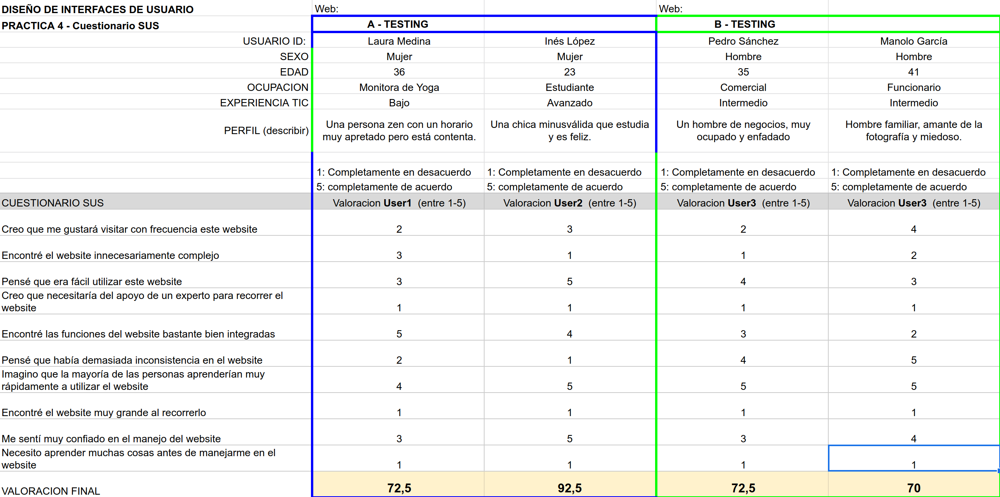
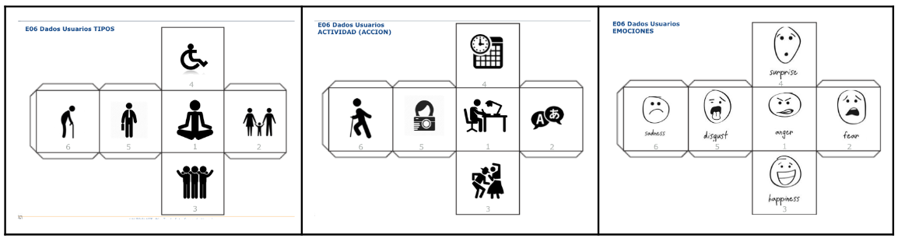

# DIU - Practica 4, entregables

## Users definition

En esta práctica se han elegido 4 usuarios los cuales tienen atributos y carácterísticas distintas elegidas al azar. 

### Atributos

- Aplicación A (CarlotaExperience)

| id | Sexo / edad | Ocupación | Experiencia internet | Perfil cubierto |
|----|------|--------------|-------------|-----|
| Inés López | Mujer / 23 | Estudiante | Avanzado | 4 - 1 - 3 |
| Laura Medina | Mujer / 36 | Monitora de yoga | Bajo | 1 - 4 - 3 |

- Aplicación B (Anca)

| id | Sexo / edad | Ocupación | Experiencia internet | Perfil cubierto |
|----|------|--------------|-------------|-----|
| Pedro Sánchez | Hombre / 35 | Comercial | Intermedio | 5 - 4 - 1 |
| Manolo García | Hombre / 41 | Funcionario | Intermedio | 2 - 5 - 2 |

### Experiencia con las distintas plataformas tecnológicas

| Plataforma | Inés López *Caso A* | Laura Medina *Caso A* | Pedro Sánchez *Caso B* | Manolo García *Caso B* |
|----|------|--------------|-------------|-------------|
| Windows | 4 / 5 | 1 / 5 | 2 / 5 | 5 / 5 |
| Mac | 1 / 5 | 0 / 5 | 5 / 5 | 1 / 5 |
| Linux | 0 / 5 | 0 / 5 | 0 / 5 | 0 / 5 |
| Iphone | 5 / 5 | 2 / 5 | 5 / 5 | 3 / 5 |

### Expectativas sobre la aplicación

- Inés López

Me gustaría poder tener cierto poder de decisión a la hora de elegir las actividades para que tengan en cuenta mis necesidades especiales. Ponerme en contacto con otros estudiantes y personas jóvenes. Tener un gran catálogo de actividades disponibles a elegir.

- Laura Medina

Sería ideal que la aplicación me permitiese proponer actividades y colaborar en ellas, como realizar una clase de yoga. Poder solicitar la fecha y la hora para realizar esos eventos también me vendría muy bien debido a que tengo poca disponibilidad horaria.

- Pedro Sánchez

Estaría bien que el site ofreciese facilidad para ver que servicios ofrecen, donde están situados e información relevante. También me gustaría poder registrarme fácilmente y completar una reserva sin malgastar mucho tiempo.

- Manolo García

Poder encontrar habitaciones familiares para poder ir con los niños sería de gran valor. Por otro lado debería disponer de un apartado de contacto que me permita llamar a la empresa, aparte de que me deje consultar distintas opiniones para saber como es el sitio de primera mano. 

## Resultados de SUS 

A continuación se muestran los resultados obtenidos a partir del cuestionario SUS en base a la experiencia de los cuatro distintos usuarios.

## Informe de usabilidad

El prototipo a evaluar a través de este informe se llama Anca y ha sido desarrollado por el equipo de DIU2.Backyardigans.

> Equipo redactor del informe: DIU2.LosMejoresDeDiu
> 
> Fecha de redacción: 01 / 06 / 2022

### Descripción

El website se basa en promocionar una propuesta de negocio acerca de un hostel llamado Anca que se situa en el barrio del realejo. Esta aplicación web muestra información sobre la marca como los servicios, qué propuesta de valor ofrece o cuales han sido las opiniones de los clientes que han podido disfrutar de una estancia allí. Por otro lado también permite al usuario crearse una cuenta y reservar habitaciones e incluso consultar la carta del restaurante.

### Resumen ejecutivo

Se ha realizado el test de usabilidad acerca del website de Anca desarrollado por Backyardigans, Anna María Blyumina Eskova y Carlos Andres Horta Rios, con el objetivo de detectar cuales son sus puntos fuertes y en qué apartados pueden mejorar.

Primero describimos la metodología a seguir, luego se procede a mostrar el resultado del análisis de la experiencia de los usuarios y por último se realiza el estudio de varios tópicos en la usabilidad de la aplicación.

- Problemas detectados
A simple vista podemos detectar algunos problemas concretos:
 * Como hemos visto un punto importante en cuanto a la identidad es que el home se debe poder procesar en muy poco tiempo y ser claro y conciso, si nos fijamos en este proyecto el home tiene demasiada información a cerca de multitud de apartados que podrían estar mejor recogidas en otras subpáginas.
 * El logo de la página no nos lleva al menú principal
 * Tamaño de fuente sobre todo en el home demasiado pequeño para que se entienda con claridad, cosa que se corrige en otras subpáginas
 * No está claro un modelo de tamaño para toda la aplicación, el home es un rectángulo vertical alargado y en cambio la sección de habitaciones pasa a una disposición horizontal más estrecha.
 * No añade una funcionalidad nueva al hostel

### La metodología que se ha seguido

Para realizar el informe se sigue una metodología que combina tanto la parte subjetiva como el análisis más formal basado en conceptos teóricos de la usabilidad. Es decir, primero se han creado dos perfiles de usuarios que van a usar el site. Estas dos personas darán cierto feedback subjetivo que se puntuará en un cuetionario SUS. A continuación se ha pasado a realizar un análisis de la usabilidad revisando qué puntos clave cumple acerca de la accesibilidad, la identidad de la marca, la navegación y el contenido. 

### Los usuarios

#### Perfiles

Se han creado dos perfiles que vienen a representar los atributos psicológicos y de conducta de dos usuarios que van a estar usando la aplicación. Estos han sido generados de manera aleatoria y por lo tanto durante su uso se ha realizado rol-play para asegurarnos de obtener datos lo más fieles posibles a cada uno.

Para poder crear una combinación de atributos se han usado los siguientes dados.

A continuación se muestra una tabla con la información de como han quedado los dos perfiles generados.

| id | Sexo / edad | Ocupación | Experiencia internet | Perfil cubierto |
|----|------|--------------|-------------|-----|
| Pedro Sánchez | Hombre / 35 | Comercial | Intermedio | Un hombre de negocios, muy ocupado y enfadado |
| Manolo García | Hombre / 41 | Funcionario | Intermedio | Hombre familiar, amante de la fotografía y miedoso. |

#### Evaluación subjetiva

- Pedro Sánchez

| PREGUNTA | 1 | 2 | 3 | 4 | 5 |
|---|---|---|---|---|---|
| Creo que me gustará visitar con frecuencia este website |  |  |  |  |  |
| Encontré el website innecesariamente complejo |  |  |  |  |  |
| Pensé que era fácil utilizar este website |  |  |  |  |  |
| Creo que necesitaría del apoyo de un experto para recorrer el website |  |  |  |  |  |
| Encontré las funciones del website bastante bien integradas |  |  |  |  |  |
| Pensé que había demasiada inconsistencia en el website |  |  |  |  |  |
| Imagino que la mayoría de las personas aprenderían muy rápidamente a utilizar el website |  |  |  |  |  |
| Encontré el website muy grande al recorrerlo |  |  |  |  |  |
| Me sentí muy confiado en el manejo del website |  |  |  |  |  |
| Necesito aprender muchas cosas antes de manejarse en el |  |  |  |  |  |

> Puntuación: **72,5**

- Manolo García

| PREGUNTA | 1 | 2 | 3 | 4 | 5 |
|---|---|---|---|---|---|
| Creo que me gustará visitar con frecuencia este website |  |  |  |  |  |
| Encontré el website innecesariamente complejo |  |  |  |  |  |
| Pensé que era fácil utilizar este website |  |  |  |  |  |
| Creo que necesitaría del apoyo de un experto para recorrer el website |  |  |  |  |  |
| Encontré las funciones del website bastante bien integradas |  |  |  |  |  |
| Pensé que había demasiada inconsistencia en el website |  |  |  |  |  |
| Imagino que la mayoría de las personas aprenderían muy rápidamente a utilizar el website |  |  |  |  |  |
| Encontré el website muy grande al recorrerlo |  |  |  |  |  |
| Me sentí muy confiado en el manejo del website |  |  |  |  |  |
| Necesito aprender muchas cosas antes de manejarse en el |  |  |  |  |  |

> Puntuación: **70**

### Análisis de la usabilidad

#### La accesibilidad

Primero evaluamos el nivel de facilidad que ofrece la aplicación al usuario para que este pueda acceder a la información.

Para empezar la página web presenta un buen contraste de colores, es decir, la mayoría de los textos son de color negro y están situados en un fondo que mayoritariamente es blanco aunque también hay secciones en los que es naranja claro o rojo, en este último caso las letras son siempre de color blanco. En conclusión, la información del site se verá bien en todos los navegadores y pantallas ya que no hay combinaciones dispares ni confusas de colores.

Por otro lado es importante analizar el tamaño de la fuente así como su espaciado entre caracteres, estas propiedades pueden hacer que el lector se frustre o se agobie. En el site se han elegido unos buenos valores para ello ya que permite que se distinga lo suficiente el contenido de los párrafos en todos los apartados, sin embargo en algunas páginas como el home, vemos que tiene un tamaño de fuente algo inferior al recomendable y se ve la información demasiado apelmazada.

#### El "branding" 

Es importante que el usuario identifique de manera sencilla la web con la marca. El branding debe responder a la pregunta que se hace un usuario cuando llega a la web de "¿Quién es esta gente?". Esto aumenta la credibilidad de la empresa y la confianza por parte de los nuevos clientes.

Lo primero que se encuentra el usuario cuando entra es el logo arriba a la izquierda, este permite identificar de un vistazo la marca ya que es visualmente llamativo. Lo que se reconoce a primera vista de este es claramente un edificio, esto es un buen símbolo ya que el usuario puede identificarlo fácilmente con el hostel, y a su vez otro aspecto positivo es que hace referencia a la A de Anca ya que el edificio se ve en diagonal acabado en un triángulo en su parte superior. Lo único que chirría en el logo es ese anillo que contiene al dibujo central el cual a simple vista no tiene relación alguna con la propuesta de la marca.

Es importante que un usuario cuando entra en la página puede distinguir enseguida de qué va y qué es lo que le ofrece la empresa. El home es algo complicado y no puede digerirse en pocos segundos ya que contiene demasiada información, no obstante se encuentran todos los apartados distribuidos de manera intuitiva y respetando los órdenes de importancia en la información. También es fácil encontrar la sección de contacto en el pie de página aunque tal vez a muchos usuarios les sería más sencillo poder acceder directamente desde el menú principal. Por último destacar que falta mostrar quien está detrás del proyecto ya que eso da confianza y seguridad.

Todos los apartados respetan a la perfección la identidad visual de la marca, usando la paleta de colores definida, y a su vez mantienen una cohesión estilística, importante para que de un aspecto atractivo y profesional.

#### La navegación

Cuando el usuario ha accedido al site y sabe con quien está tratando y que se le ofrece es hora de que se le facilite al máximo el acceso a toda la información de manera intuitiva y sencilla para que pueda navegar cómodamente y consultar lo que quiera sin problemas.

La aplicación cuenta con un menú perfectamente identificable desde el primer momento en el que el usuario entra. Este contiene el número perfecto de elementos para que una persona no se sienta abrumada y pueda gestionar la información de manera ágil y sencilla. Por otro lado presenta botones, estos llevan asociados enlaces, con la información orientativa concisa para permitir al usuario identificar a donde le llevará si lo pulsa.

Como aspectos negativos hay que destacar que la distribución del menú es estraña ya que parecen botones sueltos con poca consistencia entre sí, aparte de que apenas se nota la opción de acceder al registro o inicio de sesión ya que no está alineada con las demás. El logo de la marca tampoco lleva asocioda ningún enlace, como suele ser en otras páginas, que lleve al usuario a la página de inicio.

#### El contenido
El contenido de la aplicación es adecuado, se han implementado la mayoría de las funcionalidades de la aplicación y las que no se especifican claramente desde donde se accederían. Consideramos que se han detallado bien todos los apartados y subsecciones.

El apartado de reserva de habitaciones es muy completo incluyendo todas las páginas por las que pasaría un usuario desde que inicia la busqueda hasta el paso justo inminente para realizar el pago, todo cuidado con un alto nivel de detalle.

Además destacar también la sección de mi perfil, que incluye un ejemplo de como quedaría una vez registrado el usuario, y se ha implementado también la opción del cambio de contraseña, además de situar otras funcionalidades muy útiles aún sin haberlas implementado.

## Conclusiones
Trás realizar esta práctica y al haber rellenado los cuestionarios SUS en base a nuestros usuarios ficticios, vemos que cumple con los estandares medios requeridos. Es un trabajo muy completo el que se nota que se le ha dedicado mucho tiempo y esfuerzo.

Sin embargo como cualquier aplicación tiene sus fallo o aspectos a mejorar, como hemos comentado el home podría ser un poco más conciso y la información secundaria encontrarse en otro apartado, además el menú podría estar mejor integrado no solo con un botón por apartado si no siguiendo un estilo más acorde al resto de la página.

A pesar de esto en conclusión consideramos que la página es completa y adecuada, implementa bién el sistema de reserva que cualquier usuario pediría para un hostel, sin añadir ninguna funcionalidad nueva.
