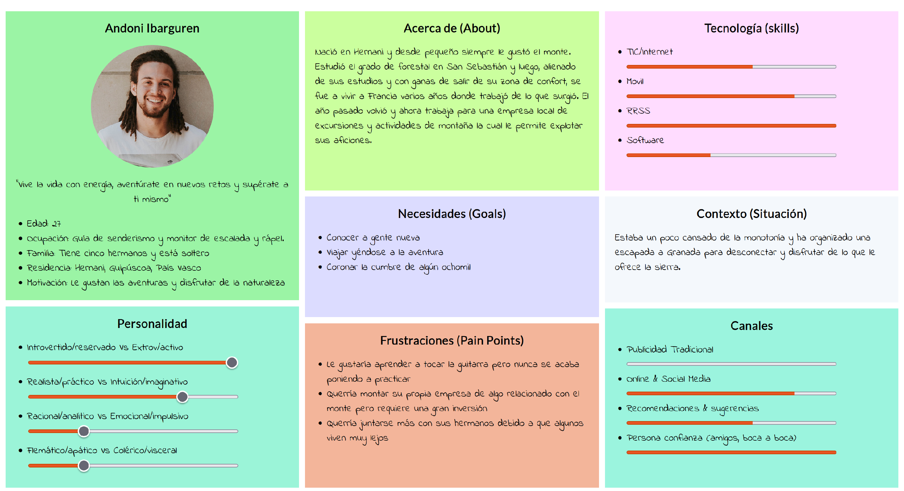
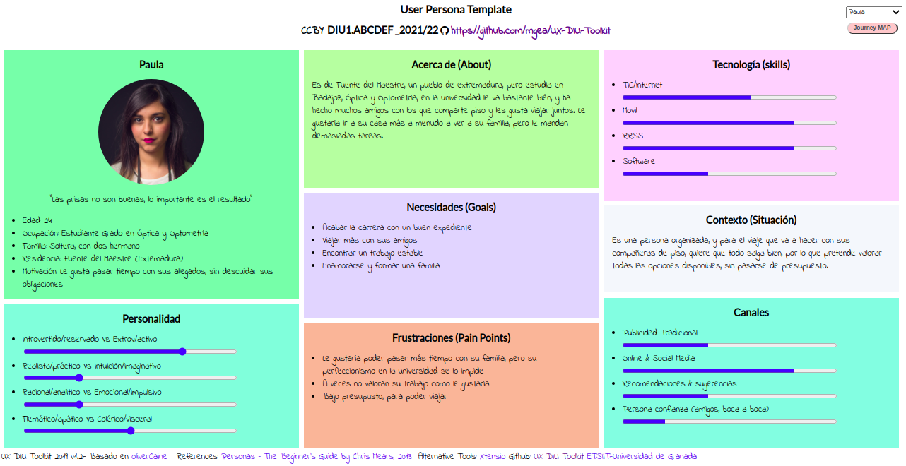
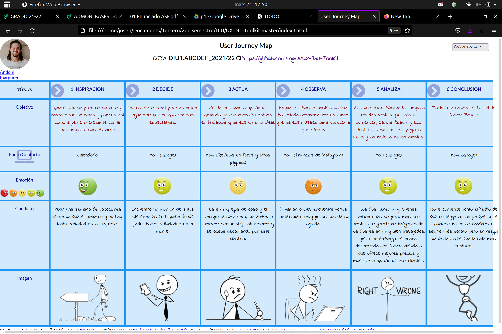
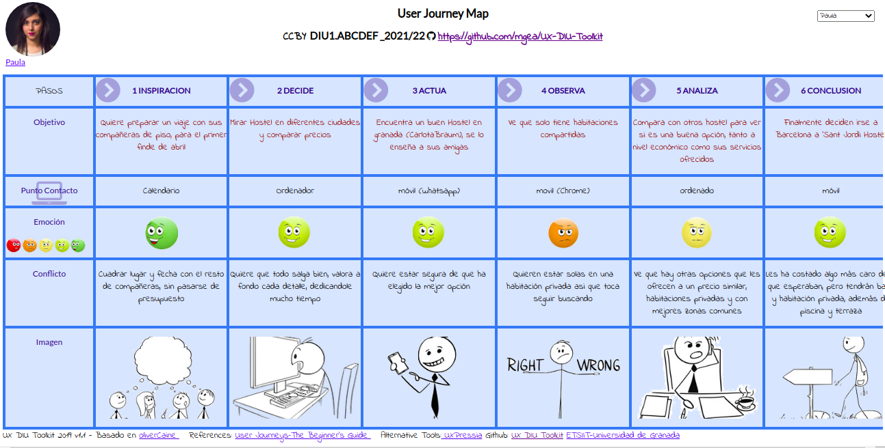

# DIU22
Prácticas Diseño Interfaces de Usuario 2021-22 (Tema: Hostels) 

Grupo: DIU2_LosMejoresDeDiu.  Curso: 2021/22 
Updated: 22/03/2022

Proyecto: 
>>> Decida el nombre corto de su propuesta en la práctica 2 

Descripción: 

>>> Describa la idea de su producto en la práctica 2 

Logotipo: 
>>> Opcionalmente si diseña un logotipo para su producto en la práctica 3 pongalo aqui

Miembros
 * :bust_in_silhouette:   Sandra Reinoso Ortega     :octocat:     
 * :bust_in_silhouette:   Josep Antoni Naranjo Llompart     :octocat:

----- 

# Proceso de Diseño 

## Paso 1. UX Desk Research & Analisis 

 1.a Competitive Analysis
-----

En la siguiente tabla se realiza un análisis entre el negocio objeto de estudio, Carlota Braun, y tres competidores de su mismo sector. Estos Hostels han sido escogidos de lugares distintos, The Central House se sitúa en Madrid, Eco Hostel está en Granada, como Carlota Braun, y Sant Jordi Hostels es una cadena de Hostels catalana.

A continuación se comparan los productos ofrecidos por cada uno así como algunas funcionalidades de la web mediante una tabla que contiene afirmaciones y negaciones así como algunas aclaraciones en los casos más ambiguos.

|  	 | [Carlota Braun](https://www.hostel-granada.es/)     | [The Central House](https://thecentralhousehostels.com/madrid-lavapies/)   |  [ECO Hostel](http://www.ecohostel.es/)    | [Sant Jordi Hostels](https://www.santjordihostels.com/es/sant-jordi-hostel-rock-palace/) |
| ------------- | -------- | ----------- | ----------- | -----------  | 
| Galería de imágenes | Si | Si | Si | Si |
| Sección de localización | Muestra los transportes y la localización | Muestra la ubicación | Muestra los transportes y la localización | Muestra la ubicación |
| Más de tres idiomas | Sí | Sí | No, solo tres | Solo dos |
| Habitaciones privadas | No | No | Sí, de 2 a 4 personas | No |
| Wiffi | Sí | Sí | Sí | Sí |
| Uso de cocina | No | No | Sí | Sí |
| Taquillas de seguridad | Sí | Sí | Sí | Sí |
| Baño privado | Sí | Sí | Sí | No |
| Aire acondicionado / Calefacción | Sí | Tiene aire acondicionado | Sí | Tiene aire acondicionado |
| Lavandería | Sí | Sí | Sí, es un extra | Sí |
| Recepción 24 horas | No, hasta las 22:00 | Sí | No | Sí |
| Guarda maletas | Sí | No | No | Sí |
| Ordenadores | No | No | No | Sí |
| Zonas comunes | No lo especifica | Terraza, solarium y playroom | Salón y cocina | Piscina, terraza y otras salas no especificadas |
| Servicio de habitaciones | Sí | Sí | No | No |

Tras la comparación, Carlota Braun ofrece un gran catálogo de servicios que iguala al de sus competidores e incluso lo supera en algunos aspectos.  Sin embargo en otros se ve que queda ligeramente por detrás, como en el uso de cocina, la recepción 24h , o en la inexistencia de ordenadores.

En conclusión Carlota Braun ofrece servicios variados que se equiparan y están al nivel del mercado actual de los hostels.

 1.b Persona
-----

Se ha procedido a la creación de dos personas, Paula y Andoni, para analizar el perfil de posibles clientes así como su actitud a la hora de buscar un hostel que se adapte a sus necesidades.

### Andoni

### Paula

 1.c User Journey Map
----

Realización de los dos mapas de experiencia de los usuarios

### Andoni

### Paula

 1.d Usability Review
----

Como documento a parte se ha adjuntado un archivo excel con la valoración de los distintos aspectos de usabilidad acerca de la página web. Cabe destacar los siguientes aspectos:

### Valoración 

Se ha obtenido una valoración general de **81** puntos sobre **100**.

### Conclusión o resumen de la valoración

Es un sitio web estéticamente atractivo, un usuario puede acceder a la información de manera intuitiva exponiéndose a tiempos de carga medianos, tiene un SEO regular.

## Paso 2. UX Design  

 2.a Feedback Capture Grid / EMpathy map / POV
----

>>> Comenta con un diagrama los aspectos más destacados a modo de conclusion de la práctica anterior,

 Interesante | Críticas     
| ------------- | -------
  Preguntas | Nuevas ideas
  
    
>>> ¿Que planteas como "propuesta de valor" para un nuevo diseño de aplicación para economia colaborativa ?
>>> Problema e hipótesis
>>>  Que planteas como "propuesta de valor" para un nuevo diseño de aplicación para economia colaborativa te
>>> (150-200 caracteres)

 2.b ScopeCanvas
----
>>> Propuesta de valor 

 2.b Tasks analysis 
-----

>>> Definir "User Map" y "Task Flow" ... 

 2.c IA: Sitemap + Labelling 
----

>>> Identificar términos para diálogo con usuario  

Término | Significado     
| ------------- | -------
  Login¿?  | acceder a plataforma

 2.d Wireframes
-----

>>> Plantear el  diseño del layout para Web/movil (organización y simulación ) 

## Paso 3. Mi UX-Case Study (diseño)

 3.a Moodboard
-----

>>> Plantear Diseño visual con una guía de estilos visual (moodboard) 
>>> Incluir Logotipo
>>> Si diseña un logotipo, explique la herramienta utilizada y la resolución empleada. ¿Puede usar esta imagen como cabecera de Twitter, por ejemplo, o necesita otra?

  3.b Landing Page
----

>>> Plantear Landing Page 

 3.c Guidelines
----

>>> Estudio de Guidelines y Patrones IU a usar 
>>> Tras documentarse, muestre las deciones tomadas sobre Patrones IU a usar para la fase siguiente de prototipado. 

  3.d Mockup
----

>>> Layout: Mockup / prototipo HTML  (que permita simular tareas con estilo de IU seleccionado)

 3.e ¿My UX-Case Study?
-----

>>> Publicar my Case Study en Github..
>>> Documente y resuma el diseño de su producto en forma de video de 90 segundos aprox

## Paso 4. Evaluación 

 4.a Caso asignado
----

>>> Breve descripción del caso asignado con enlace a  su repositorio Github

 4.b User Testing
----

>>> Seleccione 4 personas ficticias. Exprese las ideas de posibles situaciones conflictivas de esa persona en las propuestas evaluadas. Asigne dos a Caso A y 2 al caso B
 

| Usuarios | Sexo/Edad     | Ocupación   |  Exp.TIC    | Personalidad | Plataforma | TestA/B
| ------------- | -------- | ----------- | ----------- | -----------  | ---------- | ----
| User1's name  | H / 18   | Estudiante  | Media       | Introvertido | Web.       | A 
| User2's name  | H / 18   | Estudiante  | Media       | Timido       | Web        | A 
| User3's name  | M / 35   | Abogado     | Baja        | Emocional    | móvil      | B 
| User4's name  | H / 18   | Estudiante  | Media       | Racional     | Web        | B 

. 4.c Cuestionario SUS
----

>>> Usaremos el **Cuestionario SUS** para valorar la satisfacción de cada usuario con el diseño (A/B) realizado. Para ello usamos la [hoja de cálculo](https://github.com/mgea/DIU19/blob/master/Cuestionario%20SUS%20DIU.xlsx) para calcular resultados sigiendo las pautas para usar la escala SUS e interpretar los resultados
http://usabilitygeek.com/how-to-use-the-system-usability-scale-sus-to-evaluate-the-usability-of-your-website/)
Para más información, consultar aquí sobre la [metodología SUS](https://cui.unige.ch/isi/icle-wiki/_media/ipm:test-suschapt.pdf)

>>> Adjuntar captura de imagen con los resultados + Valoración personal 

 4.d Usability Report
----

>> Añadir report de usabilidad para práctica B (la de los compañeros)

>>> Valoración personal 

>>> ## Paso 5. Evaluación de Accesibilidad  (no necesaria)

>>>   5.a Accesibility evaluation Report 
>>>> ----

>>> Indica qué pretendes evaluar (de accesibilidad) sobre qué APP y qué resultados has obtenido 

>>> 5.a) Evaluación de la Accesibilidad (con simuladores o verificación de WACG) 
>>> 5.b) Uso de simuladores de accesibilidad 

>>> (uso de tabla de datos, indicar herramientas usadas) 

>>> 5.c Breve resumen del estudio de accesibilidad (de práctica 1) y puntos fuertes y de mejora de los criterios de accesibilidad de tu diseño propuesto en Práctica 4.

## Conclusión final / Valoración de las prácticas

>>> (90-150 palabras) Opinión del proceso de desarrollo de diseño siguiendo metodología UX y valoración (positiva /negativa) de los resultados obtenidos  

